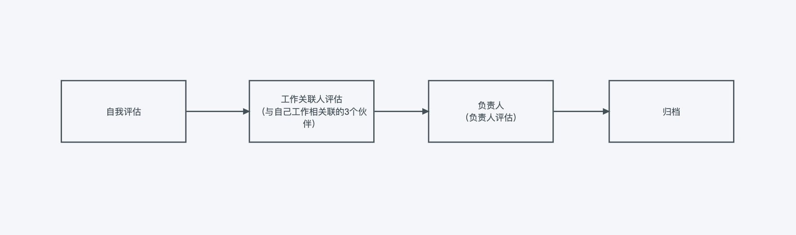
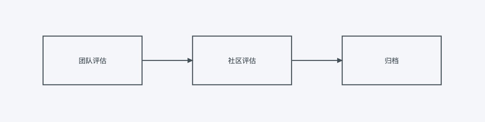

[中文版](#1)

[English](#2)

<h2 id="1">中文版</h2>

### Freechat Github Fips:

https://github.com/FreeChatDevelopment/FIPs/blob/main/FIP/fip-13.md

|    提案时间    |                                                         链接                                                     |  结果 |
| :--------: | :----------------------------------------------------------------------------------------------------------------: | :-: |
| 2022-10-30 | https://snapshot.org/#/freechatdao.eth/proposal/0x5dc3fb0e38bd1ef97c2124c3dc1c61dff8e382d177475456dc7dee794c6af560 |  待定 |
| —————————— | —————————————————————— |  待定 |

## FreechatDAO开发团队工作制度及薪酬体系制度

### 介绍

FreechatDAO是基于WEB3.0分布式工作组织，员工分布于各个国家，为优化人事和管理制度、薪酬制度、激励制度制定本提案进行管理和运行。 FreechatDAO使用Hubstaff软件进行薪酬统计和考勤统计，按工作时间和时薪制、代币激励等进行薪酬的发放。

### 工作类别

社区工作类别分为两类：全职工作、兼职工作

两种工作类别对应不同薪酬福利。

### 工作制度和考勤

工作时间及地点均为远程和居家办公方式进行工作。

### 试用期

无论兼职、全职工作类别，入职员工均有1个月试用期，不发放代币激励。

### 代币激励

代币激励按月进行发放。由社区开发团队持有的代币池进行发放，开发团队代币不足时，由社区提案确认进行拨付。

* **激励发放**：入职时确定数量

FreeChatDevelopment开发团队的激励数量如下所示：

* **代币名称**：Freechat Coin
* **代币简称**：FCC
* **激励数量**：200,000,000
* **持有地址**：[0xffea96598a93a8523dbcf318fdef78f3d93892f0](https://etherscan.io/token/0x171b1daefac13a0a3524fcb6beddc7b31e58e079?a=0xffea96598a93a8523dbcf318fdef78f3d93892f0)
* **锁仓限制**：2025-08-22 解除限制
*   **代币激励规则**：

    评定规则：入职时确认是否需要激励，每36个月重新评定一次。评定依据3年内的12次季度工作评估。

    评定周期：36个月

    发放周期：每月发放一次
*   **特别说明**： 开发团队所持有的代币目前有锁仓限制。解除限制后，根据实际工作的时长进行发放和名单发放。

    特别条款：F14职级以下工作不满18个月，代币激励作废。F14职级以上工作不满36个月，代币激励作废。

    名单依据[FIP-16提案]((https://github.com/FreeChatDevelopment/FIPs/blob/main/FIP/fip-16.md))

### 全职工作

*   **工作时间**：

    建议工作时间段，也可自行合理安排时间：

    早班：上午 9:00-12:00 下午 13:00-18:00

    中班：上午 10:00-12:00 下午 13:00-19:00

    晚班：下午 13:00-18:00 下午 19:00-22:00
*   **工作日**：

    周一、周二、周三、周四、周五
*   **休息日**：

    周六、周日、各国法定节假日
*   **薪酬制度**：

    时薪制
*   **发放时间**：每月2号
*   **考勤管理制度**：

    工作时长和考勤采用Hubstaff软件进行考勤统计。

    工作时长：每周40小时，每月160小时

    活跃度要求：月均活跃度不低于50%。

    #### 全职薪酬发放方式

    发放薪酬货币为USDT。

    *   **岗位薪酬等级**：

        执行[FIP-12提案](https://github.com/FreeChatDevelopment/FIPs/blob/main/FIP/fip-12.md)

        以上职级为对应的薪酬标准。F14-F20职级进行特殊评定，由社区决定。

        #### 岗位评定参数

        * **评价格式**：不合格、合格、优秀
        * **F1-F13职级评定时间**：每季度
        * **F14-F20职级评定时间**：每年度

        **评定表格模版（F1-F13职级评估）：**

        |        评估选项        |          评估参数         |   填写参数格式  |                   评估标准                   |
        | :----------------: | :-------------------: | :-------: | :--------------------------------------: |
        |        被评估人        |           呢称          | 填写被评估人的呢称 |                     -                    |
        |     进度完成情况（自评）     |          延期数量         | 不合格、合格、优秀 |      延期2个以内为优秀、6个以内为合格，6个以上不合格（含6个）      |
        |   代码、设计、数据质量（自评）   | 注释、规范、逻辑、设计、原型、数据完成质量 | 不合格、合格、优秀 | 未注释、代码杂乱无章、逻辑混乱、设计质量差、原型质量差、数据目标未完成等为不合格 |
        |      响应时间（自评）      |       在岗和沟通响应时间       | 不合格、合格、优秀 |           自收到通知起，24个小时内得到响应和支持。          |
        |       关联人评估选项      |          评估参数         |   填写参数格式  |                     -                    |
        |        关联人1        |           呢称          |  填写关联人的呢称 |                     -                    |
        |    进度完成情况（关联人评）    |          延期数量         | 不合格、合格、优秀 |         延期2个以内为优秀、6个以内为合格，6个以上不合格        |
        |     响应时间（关联人评）     |       在岗和沟通响应时间       | 不合格、合格、优秀 |           自收到通知起，24个小时内得到响应和支持。          |
        |        关联人2        |           呢称          |  填写关联人的呢称 |                     -                    |
        |    进度完成情况（关联人评）    |          延期数量         | 不合格、合格、优秀 |         延期2个以内为优秀、6个以内为合格，6个以上不合格        |
        |     响应时间（关联人评）     |       在岗和沟通响应时间       | 不合格、合格、优秀 |           自收到通知起，24个小时内得到响应和支持。          |
        |        关联人3        |           呢称          |  填写关联人的呢称 |                     -                    |
        |    进度完成情况（关联人评）    |          延期数量         | 不合格、合格、优秀 |         延期2个以内为优秀、6个以内为合格，6个以上不合格        |
        |     响应时间（关联人评）     |       在岗和沟通响应时间       | 不合格、合格、优秀 |           自收到通知起，24个小时内得到响应和支持。          |
        |       负责人评估选项      |          评估参数         |   填写参数格式  |                     -                    |
        |  Hubstaff活跃率（负责人评） |  Hubstaff季度平均活跃率和工作时长 | 不合格、合格、优秀 |         低于50%不合格，50%以上合格，65%以上为优秀        |
        | Hubstaff工作时长（负责人评） |     Hubstaff季度工作时长    | 不合格、合格、优秀 |     低于200小时不合格，200以上小时为合格，240以上小时为优秀。    |
        |    进度完成情况（负责人评）    |         季度延期数量        | 不合格、合格、优秀 |         延期2个以内为优秀、6个以内为合格，6个以上不合格        |
        |  代码、设计、数据目标质量（自评）  | 注释、规范、逻辑、设计、原型、数据完成质量 | 不合格、合格、优秀 | 未注释、代码杂乱无章、逻辑混乱、设计质量差、原型质量差、数据目标未完成等为不合格 |
        |     响应时间（负责人评）     |       在岗和沟通响应时间       | 不合格、合格、优秀 |           自收到通知起，24个小时内得到响应和支持。          |
        |     工作态度（负责人评）     |     工作态度、职业道德等综合判断    | 不合格、合格、优秀 |         对评估人进行工作态度方面的判断，尽职、职业道德等。        |

        **评估方法**

        * **自行评估**：自行评估。
        * **关联人评估**：邀请3个与自己工作有关联人员进行评估。
        * **负责人评估**：负责人对被评估人进行评估。

        **F1-F13评估时间**

        每季度

        **晋级标准**

        3个合格，12个优秀，晋升下一职级。

        **保级标准**

        7个合格，8个优秀则正常保级。

        **降级标准**

        8个不合格，则降级。达到10个不合格则进行劝退处理。

        **日常处罚机制**

        每月发薪日达不到最低活跃度50%要求，按实际活跃度计算薪酬。

        计算公式：月薪酬*月均实际活跃度=实际发放薪酬

        *   **评定流程**

            

        **F14-F20职级评定表格模版**

        | 评估选项 |    评估参数   |   填写参数格式  |    评估标准   |
        | :--: | :-------: | :-------: | :-------: |
        | 被评估人 |     呢称    |  填写评估人的呢称 |           |
        | 管理工作 | 社区开发等管理工作 | 不合格、合格、优秀 | 所在项目组成员评估 |
        | 社区治理 |   社区治理工作  | 不合格、合格、优秀 |   社区提案决定  |
        | 社区发展 | 社区发展目标完成度 | 不合格、合格、优秀 |   社区提案决定  |
        | 目标承诺 |  是否达到承诺目标 | 不合格、合格、优秀 |   社区提案决定  |
        | 响应时间 | 在岗和沟通响应时间 | 不合格、合格、优秀 | 所在项目组成员评估 |

        **F14-F20评估时间**

        每年度

        **继任标准及奖励**

        3个合格以上为继任标准

        4个优秀以上由社区进行奖励，奖励如下。

        执行[FIP-12提案]((https://github.com/FreeChatDevelopment/FIPs/blob/main/FIP/fip-12.md))

        **退任标准**

        每年度进行评定工作，3个不合格即退任，由社区提案投票决定继任者，移交相关账户权限。
    *   **评定流程**

        

    **说明**

    社区将根据运营情况，调整每个职级时薪薪酬，并进行社区提案，提案通过后将调整每个职位薪酬。

    社区岗位薪酬限制提案: [FIP-12](https://github.com/FreeChatDevelopment/FIPs/blob/main/FIP/fip-12.md)

### 兼职工作

*   **薪酬制度**：

    时薪制
* **发放时间**：每月2号
*   **考勤管理制度**：

    工作时长和考勤采用Hubstaff软件进行考勤统计。

    工作时长：每周不低于20小时，可在任意时间进行工作，不受节假日等限制

    活跃度要求：月均活跃度不低于50%。

    #### 兼职薪酬发放方式

    发放薪酬货币为USDT。
*   **岗位薪酬等级**：

    执行[FIP-12提案](https://github.com/FreeChatDevelopment/FIPs/blob/main/FIP/fip-12.md)

    #### 岗位评定参数

    * **评价格式**：不合格、合格、优秀
    * **J1-J9（职级评定时间）**：每季度

    **评定表格模版（J1-J9职级评估）：**

    |        评估选项        |          评估参数         |   填写参数格式  |                   评估标准                   |
    | :----------------: | :-------------------: | :-------: | :--------------------------------------: |
    |        被评估人        |           呢称          | 填写被评估人的呢称 |                     -                    |
    |     进度完成情况（自评）     |          延期数量         | 不合格、合格、优秀 |      延期2个以内为优秀、6个以内为合格，6个以上不合格（含6个）      |
    |   代码、设计、数据质量（自评）   | 注释、规范、逻辑、设计、原型、数据完成质量 | 不合格、合格、优秀 | 未注释、代码杂乱无章、逻辑混乱、设计质量差、原型质量差、数据目标未完成等为不合格 |
    |      响应时间（自评）      |       在岗和沟通响应时间       | 不合格、合格、优秀 |           自收到通知起，24个小时内得到响应和支持。          |
    |       关联人评估选项      |          评估参数         |   填写参数格式  |                     -                    |
    |        关联人1        |           呢称          |  填写关联人的呢称 |                     -                    |
    |    进度完成情况（关联人评）    |          延期数量         | 不合格、合格、优秀 |         延期2个以内为优秀、6个以内为合格，6个以上不合格        |
    |     响应时间（关联人评）     |       在岗和沟通响应时间       | 不合格、合格、优秀 |           自收到通知起，24个小时内得到响应和支持。          |
    |        关联人2        |           呢称          |  填写关联人的呢称 |                     -                    |
    |    进度完成情况（关联人评）    |          延期数量         | 不合格、合格、优秀 |         延期2个以内为优秀、6个以内为合格，6个以上不合格        |
    |     响应时间（关联人评）     |       在岗和沟通响应时间       | 不合格、合格、优秀 |           自收到通知起，24个小时内得到响应和支持。          |
    |        关联人3        |           呢称          |  填写关联人的呢称 |                     -                    |
    |    进度完成情况（关联人评）    |          延期数量         | 不合格、合格、优秀 |         延期2个以内为优秀、6个以内为合格，6个以上不合格        |
    |     响应时间（关联人评）     |       在岗和沟通响应时间       | 不合格、合格、优秀 |           自收到通知起，24个小时内得到响应和支持。          |
    |       负责人评估选项      |          评估参数         |   填写参数格式  |                     -                    |
    |  Hubstaff活跃率（负责人评） |  Hubstaff季度平均活跃率和工作时长 | 不合格、合格、优秀 |         低于50%不合格，50%以上合格，65%以上为优秀        |
    | Hubstaff工作时长（负责人评） |     Hubstaff季度工作时长    | 不合格、合格、优秀 |     低于200小时不合格，200以上小时为合格，240以上小时为优秀。    |
    |    进度完成情况（负责人评）    |         季度延期数量        | 不合格、合格、优秀 |         延期2个以内为优秀、6个以内为合格，6个以上不合格        |
    |  代码、设计、数据目标质量（自评）  | 注释、规范、逻辑、设计、原型、数据完成质量 | 不合格、合格、优秀 | 未注释、代码杂乱无章、逻辑混乱、设计质量差、原型质量差、数据目标未完成等为不合格 |
    |     响应时间（负责人评）     |       在岗和沟通响应时间       | 不合格、合格、优秀 |           自收到通知起，24个小时内得到响应和支持。          |
    |     工作态度（负责人评）     |     工作态度、职业道德等综合判断    | 不合格、合格、优秀 |         对评估人进行工作态度方面的判断，尽职、职业道德等。        |

    
    #### 评估方法

    * **自行评估**：自行评估。
    * **关联人评估**：邀请3个与自己工作有关联人员进行评估。
    * **负责人评估**：负责人对被评估人进行评估。

    **J1-J9评估时间**

    每季度

    **晋级标准**

    3个合格，12个优秀，晋升下一职级。

    **保级标准**

    7个合格，8个优秀则正常保级。

    **降级标准**

    8个不合格，则降级。达到10个不合格则进行劝退处理。

    **日常处罚机制**

    每月发薪日达不到最低活跃度50%要求，按实际活跃度计算薪酬。

    计算公式：月薪酬\*月均实际活跃度=实际发放薪酬

    **评定流程**

    

    **说明**

    社区将根据运营情况，调整每个职级时薪薪酬，并进行社区提案，提案通过后将调整每个职位薪酬。

    社区岗位薪酬限制提案: [FIP-12](https://github.com/FreeChatDevelopment/FIPs/blob/main/FIP/fip-12.md)

### 会议时间及会议补偿

每次会议会占用大量的时间，无法进行量化计算。 因此，每月对所有社区开发人员作为会议时间的补偿。补偿费用将包含至薪资中。

执行依据：[FIP-12](https://github.com/FreeChatDevelopment/FIPs/blob/main/FIP/fip-12.md)

### FreechatDAO职级评估委员会

负责社区开发人员职级评估、面试等工作。

|     呢称    | 负责内容 |
| :-------: | :--: |
| Jack Long | 职级评估 |
| Danny Guo | 职级评估 |
|    00N    | 职级评估 |
|    Lily   | 职级评估 |
|    Kang   | 职级评估 |

### 社区开发团队成员、薪酬、激励名单

FreeChatDevelopment开发团队名单及薪酬如下公示：

FreeChatDevelopment Team: [FIP-16](https://github.com/FreeChatDevelopment/FIPs/blob/main/FIP/fip-16.md)

（社区成员名单会随时进行进行变动，请注意。）

### 加入社区开发团队

FreechatDAO社区开发团队欢迎任何人及组织加入，如有兴趣可向以下电子邮箱发送简历或介绍：

电子邮箱：talent@freechat.world

### 版权放弃声明

Copyright and related rights waived via [CC0](https://github.com/ethereum/EIPs/blob/master/LICENSE.md)

-------------------------

<h3 id="2">English</h3>
