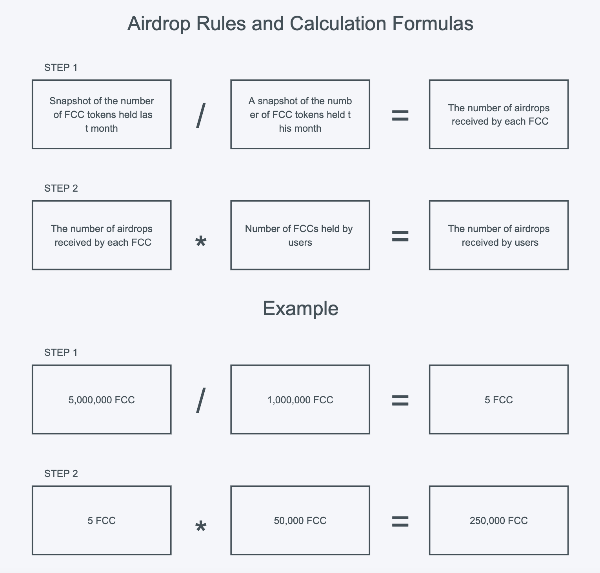

[中文版](#1)

[English](#2)

<h2 id="1">中文版</h2>

## Freechat Github Fips: 

https://github.com/FreeChatDevelopment/FIPs/blob/main/FIP/fip-14.md

  | 提案时间 | 链接 | 结果 |
  |:-:|:-:|:-:|
  | YYYY-MM-DD |FreechatDAO社区对应的提案链接|待定|

# Freechat Coin（FCC）市场激励空投计划

## 目的
发放Freechat Coin（FCC）空投奖励进行去中心化治理。

## 流动性激励空投方案

- **空投持续时间**：12个月

- **空投开始与结束时间**：2023-01-01开始至2023-12-31结束

- **每月空投数量**：上月快照时间用户持仓总量（统计时间为每月15日14:00）

- **每月空投上限**：防止恶意对社区造成破坏，每月空投上限不超过1,000,000 FCC

- **空投规则**：每月随机时间截取快照统计持有FCC的用户进行空投。

- **空投奖励**：Freechat Coin（FCC）

- **计算公式**：上月用户持仓总量/快照时间FCC持仓总量=每FCC空投数量*持仓数量=空投数量
         
    - **示例**：
  
      #### 第一步 获得每月空投总量
      如2023-01-15 14:00为截取快照时间，统计出快照所有地址持有5,000,000 FCC即是每月空投总量
      
      #### 第二步 快照时间用户持仓总量
      如2023-01-17 20:15为截取快照时间，快照所有地址持有10,000,000 FCC即是用户快照持仓总量
      
      #### 第三步 计算每个FCC可获得空投数量
      通过第一步和第二步结果得出每月空投总量为5,000,000 FCC,快照用户持仓总量为10,000,000 FCC
      
      计算结果如下：
      
      #### 5,000,000 FCC/10,000,000 FCC=0.2FCC（每个FCC可获得空投数量）

      #### 第四步 用户可获得空投数量

      A用户持仓50,000 FCC，通过第三步结果进行计算就可以得出A用户获得空投数量。
      
      计算结果如下：

      #### 0.2 FCC*50,000 FCC=10,000 FCC（用户获得空投数量）

      空投计算图示：
      
      

 - **可交易市场**：

   [Freechat](https://freechat.world) 

   [Uniswap](https://app.uniswap.org/#/swap) 

   [1inch](https://app.1inch.io/)

 - **不参与空投名单**：
  
   为保证空投公平性，确保社区成员、用户及去中心化治理的实施，以下账户不参与空投：
   - **FreechatDAO社区地址**：
  
      [0x9e9839dffe5c779e232be11874f80ce3fb5a28f8](https://etherscan.io/token/0x171b1daefac13a0a3524fcb6beddc7b31e58e079?a=0x9e9839dffe5c779e232be11874f80ce3fb5a28f8)
    - **FreechatDAO开发团队地址**：
    
      [0xffea96598a93a8523dbcf318fdef78f3d93892f0](https://etherscan.io/token/0x171b1daefac13a0a3524fcb6beddc7b31e58e079?a=0xffea96598a93a8523dbcf318fdef78f3d93892f0)
    - **投资人地址**：   
    
      [0x2d8935fe725d4111d32e7f487978e3bdbf939d0a](https://etherscan.io/token/0x171b1daefac13a0a3524fcb6beddc7b31e58e079?a=0x2d8935fe725d4111d32e7f487978e3bdbf939d0a)
    - **市场流通地址**：
  
      [0xce340ed98522bbfc131ea0d2d29d2e2604992cce](https://etherscan.io/token/0x171b1daefac13a0a3524fcb6beddc7b31e58e079?a=0xce340ed98522bbfc131ea0d2d29d2e2604992cce)
    
      所有流动池地址（包含未来加入的所有交易对）

## 快照时间及检查
为保证公平性，每月随机时间段进行快照截取和统计。

快照时间：每月随机时间段

## 空投发放信息
为保证市场不受外部影响，空投使用市场流通的账户的进行空投发放，以下为空投激励的账户相关信息。

市场流通账户信息
- **持有FCC数量**：200,000,000
- **账户释义**：发放账户为市场流通账户，所持有FCC是不受任何锁仓限制的流通代币，可随意交易和处置。
- **发放地址**：[0xce340ed98522bbfc131ea0d2d29d2e2604992cce](https://etherscan.io/token/0x171b1daefac13a0a3524fcb6beddc7b31e58e079?a=0xce340ed98522bbfc131ea0d2d29d2e2604992cce)
- **发放时间**：截取快照后5日内，根据截取时间段快照内名单进行发放。

## 相关资料

社区治理：
https://snapshot.org/#/freechatdao.eth

社区协议条款：
https://docs.freechat.world

项目开源仓库：
https://github.com/FreeChatDevelopment

代币经济学与白皮书：
https://docs.freechat.world/fdao-she-qu

FreechatDAO社群：
https://twitter.com/freechat_app

商业计划书：https://github.com/FreeChatDevelopment/FIPs/blob/main/assets/fip-14/FreechatBP.pdf

Freechat Coin流动池与交易对：

[USDT-FCC](https://info.uniswap.org/#/pools/0x03de8b89caa2bbe8bf09979d370aaf08a35cbfa1)

[ETH-FCC](https://info.uniswap.org/#/pools/0xf9c97668f97160b18c87a40ea26c0c87e9becc8d)

## 版权放弃声明
Copyright and related rights waived via [CC0](https://github.com/ethereum/EIPs/blob/master/LICENSE.md)

-------------------------

<h3 id="2">English</h3>