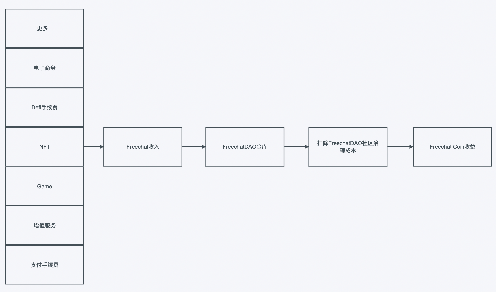

[中文版](#1)

[English](#2)

<h2 id="1">中文版</h2>

## Freechat Github Fips: 

https://github.com/FreeChatDevelopment/FIPs/blob/main/FIP/fip-9.md

# Freechat白皮书

## 前言

Web2.0时代，用户的隐私和数据都是寡头们的盈利工具，用户毫无权利去改变这一现状，还要接受各种形式的审查，随时随地都在被迫接受寡头们的权益侵害。寡头利用用户谋取巨额利益时，这些都和用户没有任何关系。用户被当做寡头们的利益养料。

在Web3.0时代，这些问题永远不会发生，用户将重新掌握主动权，每个人都将有虚拟世界和互联网的个体所有权，这才是真正意义上的网络世界，用户可以随时拒绝任何索取，除非用户自愿授权。互联网不再是寡头们说了算，用户权利将重新回到用户手中。

## 什么是 FreechatDAO

FreechatDAO是一个去中心化的开发组织及运营组织，简称FDao，由全球开发者及用户组成，任何人及组织都可以参与社区治理。

FreechatDAO崇尚自由。在FreechatDAO社区，自由、人权、隐私是不可侵犯的用户基本权利，每个人都有言论自由的权利和隐私安全的保障，并且不受任何形式干扰和审查。

愿景：成为去中心化、开放、透明、安全、自由、自治的社交网络与社区

可以通过[FIP-11提案](https://github.com/FreeChatDevelopment/FIPs/blob/main/FIP/fip-11.md)获得关于社区介绍的详细信息。

## 什么是 Freechat

Freechat是一款基于Web3.0与区块链技术开发的一款安全，私密、自由的社交应用。使用端到端加密的通信方式，以确保隐私和通信的自由。此外，Freechat的技术特点不会因某些网络限制而无法使用。Freechat有许多基于社交应用的创新，比如基于NFT的虚拟形象；基于区块链的好友评分信用体系，去中心化的激励广告网络、SNS、支付网络、电子商务、游戏、金融等组成的超级生态。

Freechat终端覆盖包括：IOS、Android、Mac、Windows等系统和设备覆盖。

网站：https://freechat.world

## 什么是 Freechat Coin

Freechat Coin用于Freechat和FreechatDAO社区治理和一系列的权益代表，目的是通过去中心化的方式，建立一系列去中心化的应用。让用户可以掌握自己的隐私和数据，包含一系列应用的治理权，收益权、所有权、消费权等。随着用户和代币持有者增长，逐渐完成去中心化治理的实现。

- **代币名称**：Freechat Coin
- **代币简称**：FCC
- **发行数量**：1,000,000,000
- **代币精度**：18
- **权益代表**：社区治理、Freechat内的应用及消费、权益代表、收益确权、投票权、社区提案等。
- **合约地址**：
[0x171b1daefac13a0a3524fcb6beddc7b31e58e079](https://etherscan.io/token/0x171b1daefac13a0a3524fcb6beddc7b31e58e079)
- **开源代码**：https://github.com/FreeChatDevelopment

## FreechatDAO社区创始团队
- **Jack Long**
    - FreechatDAO社区创始人，负责社区治理、发展及产品等工作，连续创业者，近10年创业经验，曾是中国西部地区最大的比特币矿工。主导研发多款产品，产品营收超上亿元人民币。
  
- **Danny Guo**
    - FreechatDAO社区联合创始人，负责社区治理、社区产品研发工作，曾任职Tencent，负责IM，Game等产品的技术研发工作。
   
- **Neilson Lee**
    - FreechatDAO社区联合创始人及天使投资人，负责社区投资、融资等工作。

- **Mia**
    - FreechatDAO社区联合创始人，美国工作和生活8年，社区发言人，媒体负责人。

- **00L**
    - FreechatDAO社区设计师，负责社区产品设计工作，与Jack Long共同工作5年。

- **00N**
    - FreechatDAO社区开工程师，负责社区研发工作，与Jack Long共同工作2年。

- **00W**
    - FreechatDAO社区UI设计师，负责社区产品设计工作，与Jack Long共同工作4年。

- **Tj4n**
    - FreechatDAO社区研发工程师，负责社区产品研发工作。前Vivo工程师。

- **更多**
    - FreechatDAO社区开发者还有来自Huobi、Binance、Tencent、Baidu、Google等优秀工程师组成。

## Freechat业务线
Freechat业务由社交、电子商务、NFT、增值业务（会员、功能会员）、广告、内容、支付、Defi、游戏等，随着时间推移，可能由更多的业务组成，形成一个基于社交的超级生态。

## Freechat Coin的经济模型

Freechat Coin基于Freechat及FreechatDAO应用价值的代币，因此所有收入均通过智能合约进行透明化治理与分配。

Freechat的基本流通体系是以稳定币作为基础锚定，所有付费及收益方式均是以稳定币作为清算方式。

Freechat的所有收入会锚定FCC作为权益代表价值。持有FCC的用户可通过质押FCC来获得Freechat产生的收益。

图例：

通过以上图例就可以得出，Freechat收入越多，相应的Freechat Coin价值越高。

公式代表：
- **收入=X**
- **社区治理成本及运营成本=Y**
- **净收入=Z**
- **FCC质押数量=G**
- **每FCC净收益=F**

收益分配的计算公式：
- **X-Y=Z**
- **Z/G=F**

#### 分红时间、分红形式、质押方式和收益计算与发放：

决策方式：社区提案决定

释义：社区提案确定Freechat的收入分红时间，分红形式，质押形式，计算每个FCC的分红权益，并进行发放。

#### 回购数量：

决策方式：社区提案决定

释义：社区提案决定FreechatDAO社区回购Freechat Coin的数量。

#### 回购定价：

决策方式：社区提案决定

释义：社区提案决定FreechatDAO社区回购Freechat Coin的价格。

#### 代币销毁：

决策方式：社区提案决定

释义：社区提案决定FreechatDAO社区回购Freechat Coin的价格及数量，并进行销毁。

#### 社区收入分配比例：

决策方式：社区提案决定

释义：社区提案决定FreechatDAO社区获得Freechat收入的比例。

## Freechat Coin代币持仓分布、条款和介绍
FreechatDAO社区
- **持有FCC数量**：295,000,000  
- **占比总量比例**：29.5%
- **地址**：[0x9e9839dffe5c779e232be11874f80ce3fb5a28f8](https://etherscan.io/token/0x171b1daefac13a0a3524fcb6beddc7b31e58e079?a=0x9e9839dffe5c779e232be11874f80ce3fb5a28f8)
- **锁仓限制**：无
- **释义**：社区所持有的代币用于社区治理和Freechat运营，发放社区开发团队薪酬。
- **限制条款**：社区使用FCC代币必须由社区提案决定。社区代表多重签名限制。

FreechatDAO开发团队（FreeChatDevelopment）
- **持有FCC数量**：200,000,000  
- **占比总量比例**：20%
- **地址**：[0xffea96598a93a8523dbcf318fdef78f3d93892f0](https://etherscan.io/token/0x171b1daefac13a0a3524fcb6beddc7b31e58e079?a=0xffea96598a93a8523dbcf318fdef78f3d93892f0)
- **释义**：用于奖励社区开发团队的开发贡献。
- **锁仓限制**：2025-08-22解除限制
- **限制条款**：锁仓期间不能进行操作及抛售。

投资人
- **持有FCC数量**：300,000,000  
- **占比总量比例**：30%
- **地址**：[0x2d8935fe725d4111d32e7f487978e3bdbf939d0a](https://etherscan.io/token/0x171b1daefac13a0a3524fcb6beddc7b31e58e079?a=0x2d8935fe725d4111d32e7f487978e3bdbf939d0a)
- **释义**：FreechatDAO及Freechat的种子轮、天使轮投资人所持有代币。
- **锁仓限制**：2025-08-22解除限制
- **限制条款**：锁仓期间不能进行操作及抛售。

市场流通
- **持有FCC数量**：200,000,000  
- **占比总量比例**：20%
- **FCC流动性提供地址**：[0xce340ed98522bbfc131ea0d2d29d2e2604992cce](https://etherscan.io/token/0x171b1daefac13a0a3524fcb6beddc7b31e58e079?a=0xce340ed98522bbfc131ea0d2d29d2e2604992cce)
- **流动性池地址（USDT-FCC）**：[0x03de8b89caa2bbe8bf09979d370aaf08a35cbfa1](https://etherscan.io/token/0x171b1daefac13a0a3524fcb6beddc7b31e58e079?a=0x03de8b89caa2bbe8bf09979d370aaf08a35cbfa1)
- **流动性池地址（ETH-FCC）**：[0xf9c97668f97160b18c87a40ea26c0c87e9becc8d](https://etherscan.io/token/0x171b1daefac13a0a3524fcb6beddc7b31e58e079?a=0xf9c97668f97160b18c87a40ea26c0c87e9becc8d)
- **释义**：DEX市场进行流通的代币
- **限制条款**：社区代表多重签名限制。

顾问
- **持有FCC数量**：5,000,000  
- **占比总量比例**：0.5%
- **地址（社区持有）**：[0x9e9839dffe5c779e232be11874f80ce3fb5a28f8](https://etherscan.io/token/0x171b1daefac13a0a3524fcb6beddc7b31e58e079?a=0x9e9839dffe5c779e232be11874f80ce3fb5a28f8)
- **释义**：用于帮助FreechatDAO和Freechat发展的贡献的奖励
- **限制条款**：社区提案公示及使用。
## 相关资料

社区治理：
https://snapshot.org/#/freechatdao.eth

社区协议条款：
https://docs.freechat.world

项目开源仓库：
https://github.com/FreeChatDevelopment

代币经济学与白皮书：
https://docs.freechat.world/jian-ti-zhong-wen/freechatdao/bai-pi-shu

FreechatDAO社群：
https://twitter.com/freechat_app